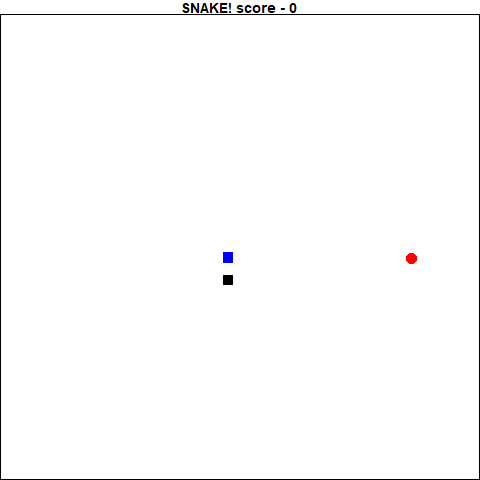
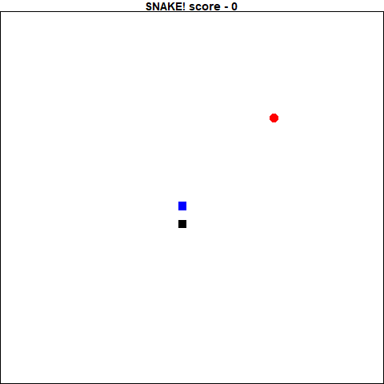

```{r setup, include = FALSE}
knitr::opts_chunk$set(
  collapse = TRUE,
  comment = "#>",
  eval=FALSE
)
```

Reinforcement learning is an interesting technique where in the user gives a model a game state and requests that it produce some sort of reaction to the state. This action is then fed back into the model to generate the next state. If the result of this action is a positive reaction, it is recorded and the model is fit to imply this action is a good one. If the result is negative, the inverse.

Eventually, after playing many games, the algorithm starts to make connections between states and the "correct" action to take. 

```{r eval=TRUE}
nomnoml::nomnoml("
[Model]->[Action]
[Action]->[Game/Simulation]
[Game/Simulation]->[reward]
[Game/Simulation]->[state]
[reward]->[Model]
[state]->[Model]
")
```

State. React. Reward. 

It is oddly similar to training my dog to do a trick.

By repeating these steps thousands of times, the deep learning algorithm "learns" the rules of the game to great effect. There are currently lots of blogs and articles devoted to this type of machine learning available in python, but none in R. I decided it was time to both learn how to do this and record it for my fellow R programmers. 

At the end I was successful in training a simple densely connected model to play the classic game "Snake" quite well. Below are two gif's. The gif on the left is the very first game it played, and the gif on the right is my final dense model's best performance.

<div style="text-align:center">
  
  
</div>

## Getting Started

My experience with deep learning is based on reading the [Deep Learning in R](https://www.manning.com/books/deep-learning-with-r) book by François Chollet with J. J. Allaire. Thankfully, I found several very helpful posts online that I used to help develop my programs. Keon Kim's blog contained a very useful introduction to reinforcement learning in ['Deep Q-Learning with Keras and Gym'](https://keon.io/deep-q-learning/), and Mauro Como's article ['How to teach AI to play Games: Deep Reinforcement Learning'](https://towardsdatascience.com/how-to-teach-an-ai-to-play-games-deep-reinforcement-learning-28f9b920440a) helped me develop my framework. Finally, I reviewed the paper from [the DeepMind team](https://storage.googleapis.com/deepmind-media/dqn/DQNNaturePaper.pdf), which really helped my understanding of the algorithm and design decisions made.

## Deep Q Network

At the heart of the training is the Deep Q Network (DQN) algorithm. The idea is that we have a function (Q) that given a state, give an action to maximize the reward. Putting this in terms of the snake game, if the head of the snake is just to the left of the food, the move that is most likely to give it a reward would be to move to the right.

Over time, the Q function is updated as is has more and more new information about the game and it sees it being played as a series of states. The Q function in a DQN is a deep learning algorithm. 

I created a refclass called "DQN_agent", that served as the framework for serving my models. It was surprisingly simple to set up, as there are not a lot of states for it to handle. I also created an object made to hold all the information needed to train each step and the methods, called "memory".

#### Memory Refclass

Refclasses can be a bit funny, but essentially it has field for containing data, and methods. They behave more similarly to other languages objects in that they are edited in-place. This memory refclass has field for each of the bits of information needed to train the model: current state, next state, action, reward and whether the game game is done or not. It also has a field for the number of states it holds to make things simpler. 

It also has methods for adding more data and sampling the outputs. Unless you are working with the DQN agent, it is unlikely you will work directly with this class.

<details>
  <summary>Toggle For Code</summary>
```{r memory}

memory<-setRefClass("memory",
            fields=list(
              state="list",
              next_state="list",
              reward="list",
              action="list",
              done="list",
              nstates="numeric"),
            methods=list(
              initialize=function(){
                nstates<<-0
              },
              add=function(s1,r,a,d,s2){
                state<<-c(state,list(s1))
                reward<<-c(reward,list(r))
                action<<-c(action,list(a))
                done<<-c(done,list(d))
                next_state<<-c(next_state,list(s2))
                nstates<<-nstates+1
              },
              sample=function(x){
                if(x=="latest"){
                  minibatch<-nstates
                }else if(x=="all"){
                  minibatch<-seq(nstates)
                }else{
                  minibatch<-base::sample(seq(nstates),x,replace = FALSE)
                }
                lapply(minibatch,function(idx){
                  list(
                    state = state[[idx]],
                    action = action[[idx]],
                    reward = reward[[idx]],
                    done = done[[idx]],
                    next_state = next_state[[idx]]
                    )
                })
              }
            ))


```
</details>

#### DQN_agent Refclass

Similarly to the memory refclass, the DQN_agent has fields for the model, and information/settings required for training the model. You might notice that one of the fields is actually holding a memory refclass object. 

There are a few more methods for this class than for memory, but it boils down to this:

1. initialize is a method to write the various decisions on training. Gamma is the degree to which the Q function will be updated, epsilon and epsilon decay are for how much randomness is introduced while training the model. The larger the epsilon decay, the longer there will be randomness. epsilon is any value between 1 and 0.
2. add_model is a utility for saving the model you define into the DQN_agent.
3. remember adds the state to the memory field.
4. train_long is the method to train the model on potentially all the available data (or a subset) within the memory object.
5. train_on is the method to train the model on a specific state/next_state pairing. 
6. next_step is the method for producing an action to take based on the trained model.


##### DQN Training

I will take a moment to discuss the training in both train_long and train_on, as they both perform similar work. Based on reading several other posts on the subject, it appears this is a standard way to train the model. Essentially the training is done a single step at a time, so no "batches" as is done in traditional deep learning.

For each state, the training goes as follows:

  1. Acquire state, feed into model to get a prediction
  2. Set the "reward" to be the recorded reward from the game
  3. If the game is not over, update the "reward" on the following:
    3.1 Predict the next action based on the next state (get probabilities for each "action"")
    3.2 Multiply the most likely probability by gamma
    3.3 Add the result to the "reward"
  4. Based on the current state, predict the next action (get probabilities for each "action")
  5. Get the actual action was was performed, and replace the prediction probability of the current state next action with the reward value
  6. Train the model on an epoch of 1, and batchsize of 1, based on the current state as the inputs and the updated prediction probabilities as the outputs
  
The idea is that you are getting what the model predicts should be the next best step and reinforcing if it was a good step positively or negatively.

<details>
  <summary>Toggle For Code</summary>
```{r DQN_agent}

DQN<-setRefClass("DQN_agent",
                 fields=list(
                   model="list",
                   mem="memory",
                   gamma="numeric",
                   epsilon="numeric",
                   e_decay="numeric"
                 ),
                 methods=list(
                   initialize=function(gamma=.9,epsilon_decay=400){
                     gamma<<-gamma
                     epsilon<<-1
                     e_decay<<-epsilon_decay
                     mem<<-new("memory")
                   },
                   add_Model=function(model){
                     model<<-list(model)
                   },
                   
                   remember=function(s1,r,a,d,s2){
                     mem$add(s1,r,a,d,s2)
                   },

                   train_long=function(len=1000){
                     if( mem$nstates > len){
                       minibatch = mem$sample(len)
                     }else{
                       minibatch = mem$sample("all")
                     }

                     for(x in minibatch){
                       target = x$reward
                       if(!x$done){
                         target = x$reward + 
                           gamma * max(next_step(x$next_state))
                       }
                       target_f = next_step(x$state)
                       target_f[which.max(x$action)] = target

                       tempModel<-model[[1]]

                       fit(tempModel,
                           x$state,
                           array(target_f,dim=dim(x$action)),
                           epochs=1,
                           verbose=0)

                       model<<-list(tempModel)
                     }
                   },

                   train_on=function(s1,r,a,d,s2){
                     target = r
                     if(!d){
                       target = r + gamma * max(next_step(s2))
                     }
                     target_f = next_step(s1)
                     target_f[which.max(a)] = target
                     tempModel<-model[[1]]
                     fit(tempModel,
                         s1,
                         array(target_f,dim=dim(a)),
                         epochs=1,
                         verbose=0)
                     model<<-list(tempModel)
                   },

                   next_step=function(state,randguess=TRUE){
                     if(runif(1)<epsilon && randguess){
                       predictions<-runif(dim(model[[1]]$output)[[2]])
                     }else{
                       predictions<-predict(model[[1]],state)
                     }
                     epsilon<<-max(.1,(epsilon)-(epsilon/e_decay))
                     return(predictions)
                   }

                 ))


```
</details>

### Snake Simulator

Next step is to actualy write the program to perform the simulation. You might already have a simulator set up, where you are able to feed in an action and it can give you back a perfect result. In my case I decided to write my own snake code. This is based off the [gridgame](https://github.com/bsspirit/gridgame) package by Conan Zhang, but naturally with my own flair and changes to output what I want. 

Thankfully snake is a rather simple game to program, and the rules are not too complicated. I was able to write out the code in a few hours. The biggest changes I found were that it can iterate though the game, outputing the stateof the game, and a reward. 

Feel free to inspect the code below.
<details>
  <summary>Toggle For Code</summary>
```{r snake_refclass}

snake<-setRefClass("snake",
                   fields=list(
                     # System variables
                     body="matrix",
                     food = "numeric",
                     direction='character',
                     length="numeric",
                     dead="logical",

                     #game info
                     score_total="numeric",
                     reward="numeric",
                     height="numeric",
                     width="numeric",
                     board="matrix",
                     log="character",
                     fruit_locations="list",

                     state_new="array"
                   ),

                   methods=list(

                     init = function(height=20,width=20,
                                     seed=floor(runif(1)*100),fruit_locs){
                       
                       set.seed(seed)
                       body<<-matrix(c(floor(width/2),
                                       floor(height/2),
                                       floor(width/2),
                                       floor(height/2)-1),
                                     byrow = FALSE,ncol=2)
                       direction<<-sample(c("up","left","right"),1)
                       reward<<-0
                       score_total<<-0
                       length<<-2
                       height<<-height
                       width<<-width
                       dead<<-FALSE
                       log<<-as.character(seed)
                       if(!missing(fruit_locs)){
                         fruit_locations<<-fruit_locs
                       }
                       updatefood()
                       updateboard()
                       get_state()

                     },

                     stepforward = function(){
                       reward<<-0
                       nextloc<-nextstep()

                       dist_fruit_orig<-sqrt(((food[1]-body[1,1])^2) + 
                                               (food[2]-body[1,2])^2)
                       dist_fruit_next<-sqrt(((food[1]-nextloc[1])^2) +
                                               (food[2]-nextloc[2])^2)
                       
                       reward<<-ifelse(dist_fruit_orig>dist_fruit_next,
                                       10,-10)
                       #check if nextLoc is body or wall, if so, fail
                       isbody<-any(do.call('c',lapply(1:nrow(body),function(x){
                         all(body[x,]==nextloc)
                         })))
                       iswall<-any(nextloc%in%c(-1,height+1,width+1))
                       if(isbody || iswall){die()}
                       #check if nextloc is food
                       isfood=all(food==nextloc)
                       if(isfood){
                         length<<-length+1
                         score_total  <<- score_total + 
                           ((floor(log(length))+1) * 5)
                         reward <<- 20
                         updatefood()
                       }

                       updatebody(nextloc)
                       if(!dead){
                         updateboard()
                       }
                     },
                     nextstep = function(direct){
                       switch(direction,
                              "up"=c(0,1),
                              "down"=c(0,-1),
                              "left"=c(-1,0),
                              "right"=c(1,0))+body[1,]

                     },
                     updatebody = function(nextloc){
                       bod<-as.numeric(body)
                       if(length>nrow(body)){
                         body<<-matrix(c(nextloc[1],
                                         bod[1:nrow(body)],
                                         nextloc[2],
                                         bod[(nrow(body)+1):(2*nrow(body))]),
                                       byrow=FALSE,ncol=2)
                       }else{
                         body<<-matrix(c(nextloc[1],
                                         bod[1:(nrow(body)-1)],
                                         nextloc[2],
                                         bod[(nrow(body)+1):((2*nrow(body))-1)]),
                                       byrow=FALSE,ncol=2)
                       }
                     },

                     updatefood = function(){
                        #figure out how to pre-specify food?
                       if(length(fruit_locations)==0){
                       pos<-sample(1:(width*height),1)
                       col<-ceiling(pos/height)
                       row<-pos%%height

                       isbody<-any(
                         do.call('c',
                                 lapply(1:nrow(body),
                                        function(x){
                                          all(body[x,]==c(col,row))
                                          })))
                       if(isbody){
                         updatefood()
                       }else{
                         food<<-c(col,row)
                       }}else{
                         food<<-fruit_locations[[1]]
                         fruit_locations<<-fruit_locations[-1]
                       }
                     },

                     updateboard = function(){
                       boardtemp<-matrix(rep(0,width*height),nrow=width)
                       boardtemp[body[1,2],body[1,1]]<-2
                       for(snake_segment in seq(2,length)){
                         boardtemp[body[snake_segment,2],
                                   body[snake_segment,1]]<-1
                       }
                       boardtemp[food[2],food[1]]<-3
                       board<<-boardtemp
                     },

                     plotboard = function(){
                       par(mar=c(0, 0, 1, 0), xaxs='i', yaxs='i')
                       plot(-1,-1,xlim=c(0,width+1),ylim=c(0,height+1),
                            type='n',axes=FALSE, frame.plot=TRUE)
                       Axis(side=1, labels=FALSE)
                       Axis(side=2, labels=FALSE)
                       points(body[,1],body[,2],
                              col=c("blue",rep('black',length-1)),pch=15,cex=2)
                       points(food[1],food[2],col="red",pch=16,cex=2)
                       title(main = paste("SNAKE! score -",score_total))
                     },

                     returnstatus = function(){

                       state<-state_new

                       get_state()

                       list(
                         state=state,
                         reward=reward,
                         action=array(
                           as.numeric(c("up","down","left","right")%in%
                                        direction),dim = c(1,4)),
                         done=dead,
                         state_new=state_new)
                     },

                     die = function(){
                       dead<<-TRUE
                       reward<<-(-20)
                     },

                     updatedirection = function(dir){
                       if(missing(dir)){
                         line<-readline("snakedir: a,w,s,d")
                         print(line)
                         dir<-switch(tolower(line),
                                     "a"="left",
                                     "w"="up",
                                     "s"="down",
                                     "d"="right",
                                     direction)
                       }
                       if(dir!=direction & okayDir(dir)){
                         direction<<-dir
                       }
                     },

                     updateLog = function(){
                       log<<-c(log,direction)
                     },

                     okayDir=function(dir){
                       dir!=switch(direction,
                                   "right"="left",
                                   "down"="up",
                                   "up"="down",
                                   "left"="right")
                     },

                     get_state=function(){

                       danger<-vector("numeric",4)
                       i<-1
                       for(nextdir in c("up","down","left","right")){
                         nextpos<-switch(nextdir,
                                         "up"=c(0,1),
                                         "down"=c(0,-1),
                                         "left"=c(-1,0),
                                         "right"=c(1,0))+body[1,]
                         danger_body<-as.numeric(any(
                           do.call('c',lapply(1:nrow(body),
                                              function(x){
                                                all(body[x,]==nextpos)
                                                }))))
                         danger_wall<-as.numeric(
                           any(nextpos%in%c(-1,nrow(board)+1,ncol(board)+1)))
                         danger[i]<-sum(c(danger_body,danger_wall))>0
                         i<-i+1
                       }

                       dirFruit<-as.numeric(c(body[1,1]<food[1],
                                              body[1,1]>food[1],
                                              body[1,2]<food[2],
                                              body[1,2]>food[2]))

                       movement <- switch(direction,
                                          "up"=c(1,0,0,0),
                                          "down"=c(0,1,0,0),
                                          "left"=c(0,0,1,0),
                                          "right"=c(0,0,0,1))

                       state_new<<-array(c(danger,dirFruit,movement),
                                         dim = c(1,12))
                     },


                     run = function(return_info=TRUE,plot_board=FALSE,delay=.3){
                       init()
                       if(plot_board){plotboard()}
                       if(return_info){returnstatus()}
                       updatedirection()
                       while(!dead){

                         stepforward()
                         plotboard()
                         if(plot_board){plotboard()}
                         if(return_info){returnstatus()}
                         if(!dead){updatedirection()}
                       }
                       text(floor(width/2),
                            floor(height/2),
                            labels = "GAME OVER",
                            col="red",cex=3)
                     },

                     run_iter = function(dir,returnStatus=FALSE){
                       if(missing(dir)){
                         dir<-direction
                       }
                       if(!dead){
                         updatedirection(dir)
                         stepforward()
                         updateLog()
                       }else{
                         return("DEAD")
                       }

                       if(returnStatus){
                         returnstatus()
                       }
                     },
                     replay = function(steps,x2,delay=.5){
                       if(is.numeric(x2)){
                         init(seed = x2)
                       }else{
                         init(fruit_locs=x2)
                       }
                       plotboard()
                       for(move in steps){
                         run_iter(move)
                         plotboard()
                         Sys.sleep(delay)
                       }
                     }
                   )
)


```
</details>

### Keras and Deep Learning

The simplest model we could use, especially based on the type of state output would be a densely connected model with several hidden layers. Dropout layers will be added to prevent over-fitting and training. I used the rmsprop optimizer because it appeared to perform better than the ADAM optimizer used by other posts.
<details>
  <summary>Toggle For Code</summary>
```{r deep_model}

library(keras)

snake_model <- keras_model_sequential()

snake_model %>%
  layer_dense(units = 256, activation = 'relu',input_shape = c(12)) %>%
  layer_dropout(0.1) %>%
  layer_dense(256, activation='relu') %>%
  layer_dropout(0.1) %>%
  layer_dense(256,activation = "relu")%>%
  layer_dropout(0.1) %>%
  layer_dense(256,activation = "relu")%>%
  layer_dropout(0.1) %>%
  layer_dense(256,activation = "relu")%>%
  layer_dropout(0.1) %>%
  layer_dense(256,activation = "relu")%>%
  layer_dense(4,activation = "softmax")

optimizer <- optimizer_rmsprop(lr = 0.0005)

snake_model %>% compile(
  loss = "mse",
  optimizer = optimizer
)

```
</details>

### Putting It All Together

Now that I have everything defined in my refclasses, we can now start the process of training the model. It is actually surprisingly simple now that we have set everything up. We simply initialize all the objects, and loop over games. A cat statement will print out the results of the game.


```{r training}

snake_game<-new("snake")
dqn_agent<-new("DQN_agent")

dqn_agent$add_Model(snake_model)

counter_games<-1
record <- 0
best_game <- 0
records <- list()
fruitPos<- list()
while(counter_games < 2000){
  # Initialize classes
  snake_game$init()
  food1 = snake_game$food

  fruitRecord<-list(food1)
  # Perform first move
  state<-snake_game$run_iter(returnStatus = TRUE)
  dqn_agent$remember(state$state,
                     state$reward,
                     state$action,
                     state$done,
                     state$state_new)
  dqn_agent$train_on(state$state,
                     state$reward,
                     state$action,
                     state$done, 
                     state$state_new)

  while(!snake_game$dead){
    #get old state
    state_old = state$state_new

    #perform random actions based on agent.epsilon, or choose the action
    prediction = dqn_agent$next_step(state_old)
    final_move = c("up","down","left","right")[which.max(prediction)]

    #perform new move and get new state
    state<-snake_game$run_iter(final_move,returnStatus = TRUE)
    if(food1!=snake_game$food){
      food1<-snake_game$food
      fruitRecord<-c(fruitRecord,list(food1))
    }

    #train short memory base on the new action and state
    dqn_agent$train_on(state$state,
                       state$reward,
                       state$action,
                       state$done,
                       state$state_new)
    # store the new data into a long term memory
    dqn_agent$remember(state$state,
                       state$reward,
                       state$action,
                       state$done,
                       state$state_new)

    score = snake_game$score_total
  }

  #retrain on all data available
  dqn_agent$train_long(3000)

  cat("Game", counter_games, "\tScore:", score,"\n")

  records<-c(records,
             list(list(game=counter_games,
                       score=score,
                       log=snake_game$log,
                       fruit_positions=fruitRecord)))
  counter_games <- counter_games + 1
}
```


## Reviewing and saving

Now that the model has been trained, the model is saved and the best model is converted into a gif to review. This is how the gif at the beginning of the post was made!

```{r save_and_print_best}

save_model_hdf5(dqn_agent$model[[1]],"snake_player.hd5")

bestScore<-max(sapply(records,`[[`,2))
bestPerf<-which.max(sapply(records,function(x)ifelse(x[[2]]==bestScore,length(x[[1]]),0)))

steps<-records[[bestPerf]][[3]]
fruit_locs<-records[[bestPerf]][[4]]

snake_game$replay(steps[-1],fruit_locs,delay = .1)

library(animation)
res<-saveGIF(
  snake_game$replay(steps[-1],fruit_locs,delay = .001),
  movie.name = "snake_animation.gif",
  interval= .07)


```


